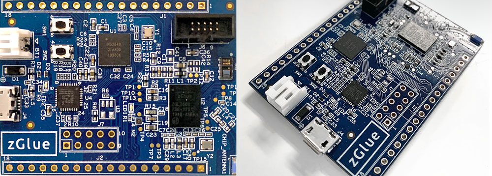

OmniChip Development Board PCB Design Files
*******************************************

.. _figure_ftdi_drivers:

Version: 1.0.0

Author(s): Jorge L. Rojas, Olivia Liao

zGlue Inc, 883 N Shoreline Blvd, C200, Mountain View, CA 94043, USA

Contact(s): jorge@zglue.com, olivia@zglue.com

*Released under zOH License v. 1.0 for open-source development*

Background
==========

`Click here to purchase an OmniChip development board <https://zglue.com/products/omnichip>`_

Want to explore zGlue's technology? Get familiar with the first active silicon interposer with the OmniChip development board. OmniChip is a full system on a chip built with this technology including: a Cortex-M4 MCU + BLE, a battery charger, a heart rate sensor, 3-axis accelerometer, 3-axis magnetometer, a temperature sensor, and a 32kHz TCXO. The hardware design files found in this repository are being released by zGlue Inc under the zGlue Open Hardware V1 license.

Make an account on zGlue's `ChipBuilder web tool <https://zglue.com/products/chipbuilder>`_, and visit the `OmniChip system design <https://chipbuilder.zglue.com/system/2647/physical/>`_ to modify the OmniChip design. With hardware at your fingertips, you can start programming your ZIP!

What's Included?
================

* OmniChip DK schematic design files
* OmniChip DK layout & gerber files
* zGlue Open Hardware License V1 (zOH V1 License)